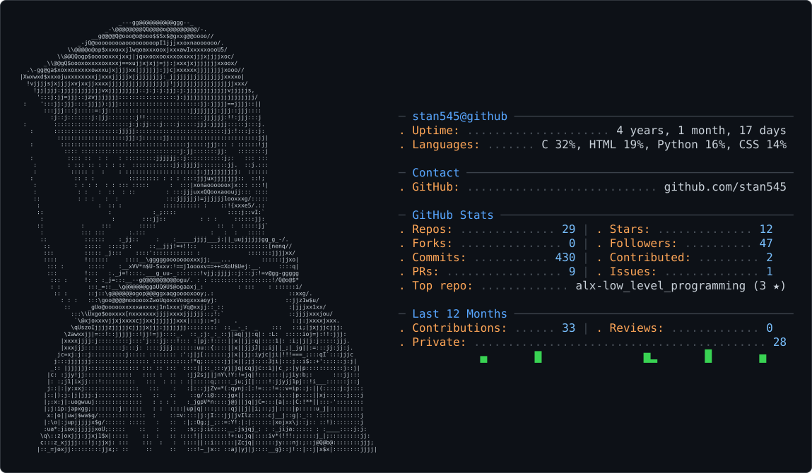

  

<picture>
  <source media="(prefers-color-scheme: dark)" srcset="dark_mode.svg" />
  <source media="(prefers-color-scheme: light)" srcset="light_mode.svg" />
  
</picture>

<h1 align="center">Hello Pal👋, I'm Henry</h1>

  

---

### 👨‍💻 About Me:
I am an aspiring Full Stack Developer
- 🔭 I’m currently working on ***Getting better in programming***
- 📝 I've knowledge of Bash,C,Java,Python,JavaScript
- 🌱 I’m currently learning ***React Native***
- 📫 You can reach me at kanuchigozie7@gmail.com.
- 💡 Once you stop learning you start dying

---
### 📱 Connect with me:

---
### 🔥 My Stats:

 
  Visitor count 
  

